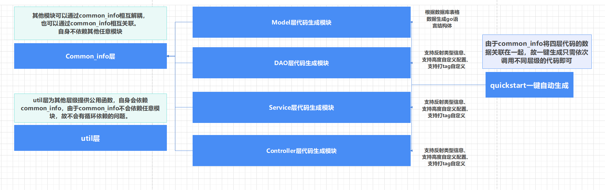
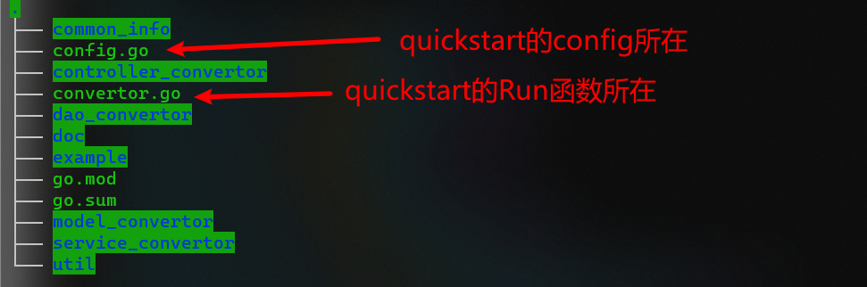

# go_project_quickstart

## 快速开始

### 要求

-   Go 1.18 及以上版本

### 安装

1.下载并安装 gin：

```
 go get -u github.com/ACking-you/quickstart_project
```

2.将 gin 引入到代码中：

```
 import "github.com/ACking-you/quickstart_project"
```

3.一键根据数据库快速逆向生成所有业务代码：

```
 import (
     "github.com/ACking-you/quickstart_project"
     "github.com/ACking-you/quickstart_project/util"
 )
 ​
 func autoQuickStart() {
     config := quickstart.DefaultConfig("项目名称", "root", "123", "127.0.0.1", 3306, "数据库名称").
     //打印出生成结果
     EnableDebug(true).
     //改变基本路径（默认为项目根目录）
     BasePath("./example")
     
     err := quickstart.Run(config)
     if err != nil {
         panic(err)
     }
 }
 ​
 func main() {
     autoQuickStart()
 }
 ​
```

上述代码，只更改了默认配置项中的两项，其他配置项的更改和作用请翻看源代码：[./config](https://github.com/ACking-you/quickstart_project/blob/master/config.go)

上述调用会一键生成 model、dao、service、vo、to、controller层的所有模板代码，且无法做到对每层代码生成的精确控制，如果本身项目已有model层的结构体，那么可以利用我提供的 [dao_convertor](https://github.com/ACking-you/quickstart_project/tree/master/dao_convertor) 、[service_convertor](https://github.com/ACking-you/quickstart_project/tree/master/service_convertor)、[controller_convertor](https://github.com/ACking-you/quickstart_project/tree/master/controller_convertor) 对整个代码生成做细化处理。

上述接口具体如何使用请点击以下文档进行查看：

[dao_convertor/example](https://github.com/ACking-you/quickstart_project/tree/master/dao_convertor/example)

[service_convertor/example](https://github.com/ACking-you/quickstart_project/tree/master/service_convertor/example)

[controller_convertor/example](https://github.com/ACking-you/quickstart_project/tree/master/controller_convertor/example)

## 项目实现

### 架构设计


对应的项目文件如下：


### 代码逻辑
上述架构设计阐述了，如何将四个单独的模块生成解耦，且同时数据也能产生关联，下面将详细介绍这一块。

#### 统一的调用逻辑
如果细心的使用者会发现，所有模块的接口调用都是统一的形式。
1. 创建对应模块的 `Config` ，通过链式调用进行配置，或者直接使用默认配置。
2. 将 `config` 传入，new出新的 `convertor` 对象。
3. 调用 `Run` 方法。当然，除了 `model_convertor` 不需要反射机制的接口外，其余的层级都提供了 `AutoMigrate` 方法供使用者选择基于哪个信息生成代码。

#### 代码复用
一、反射信息生成函数复用

最开始，在写 [dao_convertor](https://github.com/ACking-you/quickstart_project/blob/master/dao_convertor/taginfo_praser.go) 的时候并未意识到解耦的重要性，但写到后面发现都要用到这个解析类型元信息的功能，而且代码十分重复，但是又不能直接抽离，因为此段逻辑与每个层级的代码产生了一定的耦合。
* 耦合体现在：每个层级的 `tag` 解析过程和需要的数据结构都是不一样的，而之前的操作则是将这部分代码嵌入到了元信息的解析中。
* 如何解耦：将耦合的代码通过函数回调的统一参数接口形式，代码便不再耦合了，成功实现复用。具体实现在 [UpdateFromStruct](https://github.com/ACking-you/quickstart_project/blob/master/util/reflect_util.go)

二、文件保存动作的复用

这个行为在所有的层级都需要用到，在解析完信息并拼装生成好代码后，最后的动作就是要保存到文件了。
我这里对文件保存动作的复用分为三个级别：
[code](https://github.com/ACking-you/quickstart_project/blob/master/util/file_util.go)
* `SaveAction`：将一个go文件分为三个组成部分，本文件包名、需要导入的包名、具体的代码内容。将上述三个信息以及保存路径传入到此函数后，会自动根据保存的路径是文件还是文件夹决定是分文件保存还是单文件保存，文件名取自 `common_info` 里各个模型数据的名字 + 当前的包名(如user_dao.go)。
* `saveHelper.singleFileSave`：无法被外界调用，**由SaveAction选择性调用**，单文件保存，计算某些必要信息后，继续调用 `SaveFile`。
* `saveHelper.multiFileSave`：无法被外界调用，**由SaveAction选择性调用**，多文件保存，计算某些必要信息后，继续调用 `SaveFile`。
* `SaveFile`：最简单且底层的封装，只需要传递文件名和文件内容，负责文件创建保存，由于所有的文件保存工作最终都会经过它，所以在此添加的任何操作将会作用于所有文件(比如可以在文件创建后利用gofmt格式化)。


对于保存的内容复杂且多的情况，直接准备好数据调用 `SaveAction` 是最好的选择，而对于只有单个文件，且数据相对固定，能很快得出文件内容的，则可以直接提前调用 `SaveFile`(如dao层的init.go)。

三、有意思的小工具轮子
* [name_util](https://github.com/ACking-you/quickstart_project/blob/master/util/name_util.go)：实现了各种代码风格的转化如snackcase->PascalCase
* [sscanf](https://github.com/ACking-you/quickstart_project/blob/master/util/sscanf.go)：一个根据格式化串和资源串来填充后续字符串变量的函数，比如
```go
Sscanf("hello( you)world)","$($)$",&s1,&s2,&s3) //s1:hello s2: you s3:world
```
写个这玩意是在使用fmt.Sscanf的时候被恶心到了，fmt版本的有分隔符的限制，所以不得不自己造个轮子了，这个主要用在tag的解析上面。

* `str_util`：暂时只写了一个StrHandleByChain，主要用于方便链式调用来操作字符串的替换等操作，实现很简单，如下：
```go
type StrHandleByChain struct {
Str string
}

func (s *StrHandleByChain) ReplaceAll(old, new string) *StrHandleByChain {
s.Str = strings.ReplaceAll(s.Str, old, new)
return s
}
```
但是能简化我的代码效果如下：
```go
strings.ReplaceAll(strings.ReplaceAll(content,"old","new"),"old","new")
=> content.ReplaceAll("old","new").ReplaceAll("old","new")
```
很明显可读性变高了，而且这还只是套了两层的结果。。。

